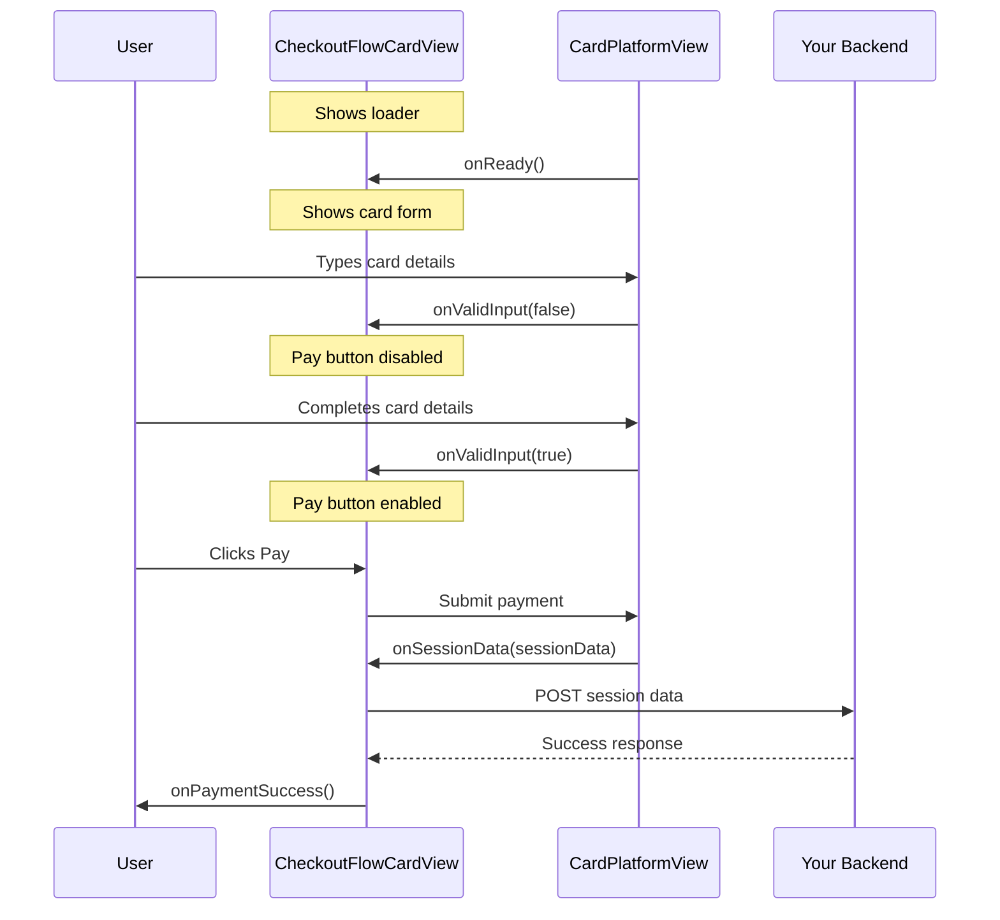

# CheckoutFlowCardView - Complete Card Payment Widget

## Overview

`CheckoutFlowCardView` is a self-contained Flutter widget that handles all aspects of card payments. All callbacks are managed internally within the widget, making it extremely easy to integrate card payments into your app.

## Features

✅ **Automatic loader management** - Shows loading indicator until card is ready  
✅ **Real-time validation** - Updates pay button state as user types  
✅ **Tokenization callbacks** - Get card tokens when ready  
✅ **Session data handling** - Receive session data for backend submission  
✅ **Payment success/error** - Handle all payment outcomes  
✅ **Custom loader support** - Use your own loading widget  

## Basic Usage

```dart
import 'package:checkout_flutter_bridge/checkout_flutter_bridge.dart';

CheckoutFlowCardView(
  paymentConfig: PaymentConfig(
    publicKey: 'pk_test_...',
    environment: Environment.sandbox,
    paymentSessionID: sessionId,
    paymentSessionSecret: sessionSecret,
  ),
  onReady: () {
    print('✅ Card view ready for input');
  },
  onValidInput: (isValid) {
    setState(() => _canPay = isValid);
  },
  onCardTokenized: (result) {
    print('Token: ${result.token}');
  },
  onSessionData: (sessionData) {
    // Submit to your backend
    _submitPaymentToBackend(sessionData);
  },
  onPaymentSuccess: (result) {
    _showSuccessDialog(result.paymentId);
  },
  onError: (error) {
    _showErrorDialog(error.errorMessage);
  },
)
```

## Complete Example

```dart
class PaymentScreen extends StatefulWidget {
  @override
  State<PaymentScreen> createState() => _PaymentScreenState();
}

class _PaymentScreenState extends State<PaymentScreen> {
  bool _isCardValid = false;
  bool _isProcessing = false;
  final _bridge = PaymentBridge();

  @override
  Widget build(BuildContext context) {
    return Scaffold(
      appBar: AppBar(title: Text('Payment')),
      body: Column(
        children: [
          // Card input widget
          CheckoutFlowCardView(
            paymentConfig: _buildPaymentConfig(),
            
            // Loading state
            onReady: () {
              print('Card view ready');
            },
            
            // Validation for pay button
            onValidInput: (isValid) {
              setState(() => _isCardValid = isValid);
            },
            
            // Tokenization result
            onCardTokenized: (result) {
              print('Card tokenized: ${result.token}');
              // Optionally save token for later use
            },
            
            // Session data for backend
            onSessionData: (sessionData) async {
              setState(() => _isProcessing = true);
              try {
                await _submitToBackend(sessionData);
              } catch (e) {
                _showError('Submission failed: $e');
              } finally {
                setState(() => _isProcessing = false);
              }
            },
            
            // Payment success
            onPaymentSuccess: (result) {
              _showSuccess('Payment successful: ${result.paymentId}');
              Navigator.pop(context);
            },
            
            // Error handling
            onError: (error) {
              _showError('${error.errorCode}: ${error.errorMessage}');
            },
            
            // Custom loader (optional)
            loader: Container(
              height: 200,
              child: Center(
                child: Column(
                  mainAxisAlignment: MainAxisAlignment.center,
                  children: [
                    CircularProgressIndicator(),
                    SizedBox(height: 16),
                    Text('Loading secure payment form...'),
                  ],
                ),
              ),
            ),
          ),
          
          SizedBox(height: 24),
          
          // Pay button
          ElevatedButton(
            onPressed: (_isCardValid && !_isProcessing) 
              ? _handlePayButtonPress 
              : null,
            child: _isProcessing
              ? CircularProgressIndicator(color: Colors.white)
              : Text('Pay Now'),
          ),
        ],
      ),
    );
  }

  Future<void> _handlePayButtonPress() async {
    // Trigger card submission
    await _bridge.submit(CurrentPaymentType(selectedType: 'card'));
  }

  PaymentConfig _buildPaymentConfig() {
    return PaymentConfig(
      publicKey: 'your_public_key',
      environment: Environment.sandbox,
      paymentSessionID: 'session_id',
      paymentSessionSecret: 'session_secret',
    );
  }

  Future<void> _submitToBackend(String sessionData) async {
    // Send session data to your backend
    final response = await http.post(
      Uri.parse('https://your-backend.com/api/payments'),
      body: {'sessionData': sessionData},
    );
    
    if (response.statusCode != 200) {
      throw Exception('Backend submission failed');
    }
  }

  void _showSuccess(String message) {
    ScaffoldMessenger.of(context).showSnackBar(
      SnackBar(content: Text(message), backgroundColor: Colors.green),
    );
  }

  void _showError(String message) {
    ScaffoldMessenger.of(context).showSnackBar(
      SnackBar(content: Text(message), backgroundColor: Colors.red),
    );
  }
}
```

## API Reference

### Properties

| Property | Type | Required | Description |
|----------|------|----------|-------------|
| `paymentConfig` | `PaymentConfig` | ✅ Yes | Payment configuration including session details |
| `onReady` | `Function()?` | No | Called when card view finishes rendering |
| `onValidInput` | `Function(bool)?` | No | Called when validation state changes |
| `onCardTokenized` | `Function(CardTokenResult)?` | No | Called when card is tokenized |
| `onPaymentSuccess` | `Function(PaymentSuccessResult)?` | No | Called on payment success |
| `onSessionData` | `Function(String)?` | No | Called when session data is ready |
| `onError` | `Function(PaymentErrorResult)?` | No | Called on any payment error |
| `loader` | `Widget?` | No | Custom loader widget (default: CircularProgressIndicator) |

### Callbacks Detail

#### onReady: `() => void`
- **When:** Card view has finished rendering and is ready for input
- **Use case:** Hide splash screen, enable UI elements
- **Called:** Once per widget lifecycle

#### onValidInput: `(bool isValid) => void`
- **When:** Card validation state changes
- **Use case:** Enable/disable pay button based on validity
- **Called:** Multiple times as user types
- **Parameter:** `isValid` - true if all fields are valid

#### onCardTokenized: `(CardTokenResult result) => void`
- **When:** Card has been successfully tokenized
- **Use case:** Save token, show confirmation
- **Parameter:** `result` contains:
  - `token` - Card token string
  - `expiryMonth`, `expiryYear` - Card expiry
  - `last4` - Last 4 digits
  - `scheme` - Card scheme (Visa, Mastercard, etc.)

#### onSessionData: `(String sessionData) => void`
- **When:** Session data is ready for backend submission
- **Use case:** Submit payment to your backend server
- **Parameter:** `sessionData` - JSON string to send to backend
- **Important:** This is where you complete the payment flow

#### onPaymentSuccess: `(PaymentSuccessResult result) => void`
- **When:** Payment completes successfully
- **Use case:** Show success message, navigate away
- **Parameter:** `result.paymentId` - Payment ID for reference

#### onError: `(PaymentErrorResult error) => void`
- **When:** Any error occurs during payment flow
- **Use case:** Show error message to user
- **Parameters:**
  - `error.errorCode` - Error code
  - `error.errorMessage` - Human-readable error message

## Payment Flow



## Custom Loader Example

```dart
CheckoutFlowCardView(
  paymentConfig: config,
  loader: Column(
    mainAxisAlignment: MainAxisAlignment.center,
    children: [
      Image.asset('assets/logo.png', width: 100),
      SizedBox(height: 20),
      CircularProgressIndicator(color: Colors.blue),
      SizedBox(height: 12),
      Text('Securing your payment...'),
    ],
  ),
)
```

## Error Handling Best Practices

```dart
onError: (error) {
  // Log error for debugging
  print('Payment error: ${error.errorCode} - ${error.errorMessage}');
  
  // Show user-friendly message
  String userMessage;
  switch (error.errorCode) {
    case 'INIT_ERROR':
      userMessage = 'Unable to initialize payment. Please try again.';
      break;
    case 'TOKEN_ERROR':
      userMessage = 'Invalid card details. Please check and try again.';
      break;
    case 'CARD_NOT_READY':
      userMessage = 'Payment form is loading. Please wait a moment.';
      break;
    default:
      userMessage = 'Payment failed: ${error.errorMessage}';
  }
  
  ScaffoldMessenger.of(context).showSnackBar(
    SnackBar(
      content: Text(userMessage),
      backgroundColor: Colors.red,
      action: SnackBarAction(
        label: 'Retry',
        onPressed: _retryPayment,
      ),
    ),
  );
},
```

## Tips

1. **Always handle all callbacks** - Even if just logging them
2. **Validate before submission** - Check `onValidInput` before allowing payment
3. **Show loading states** - Use `_isProcessing` flag during backend submission
4. **Test error scenarios** - Invalid cards, network failures, etc.
5. **Log for debugging** - Helps troubleshoot production issues

## Migration from Old Pattern

**Before (using PaymentBridge directly):**
```dart
class _PaymentScreenState extends State<PaymentScreen> {
  final _bridge = PaymentBridge();
  
  @override
  void initState() {
    super.initState();
    _bridge.onCardTokenized = (result) { /* ... */ };
    _bridge.onError = (error) { /* ... */ };
  }
  
  @override
  Widget build(BuildContext context) {
    return CardNativeView(paymentConfig: config);
  }
}
```

**After (using CheckoutFlowCardView):**
```dart
@override
Widget build(BuildContext context) {
  return CheckoutFlowCardView(
    paymentConfig: config,
    onCardTokenized: (result) { /* ... */ },
    onError: (error) { /* ... */ },
  );
}
```

Much cleaner! 🎉
