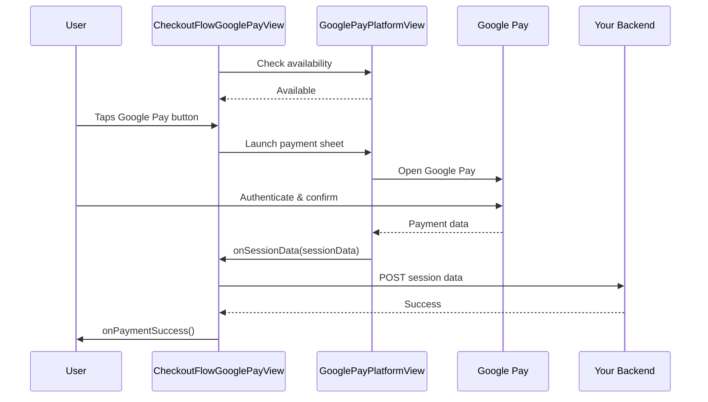

# CheckoutFlowGooglePayView - Complete Google Pay Payment Widget

## Overview

`CheckoutFlowGooglePayView` is a self-contained Flutter widget that handles all aspects of Google Pay payments. All callbacks are managed internally within the widget.

## Features

✅ **Automatic availability checking** - Detects if Google Pay is available  
✅ **Tokenization callbacks** - Get payment tokens  
✅ **Session data handling** - Receive session data for backend submission  
✅ **Payment success/error** - Handle all payment outcomes  
✅ **Unavailable fallback** - Handle devices without Google Pay  

## Basic Usage

```dart
import 'package:checkout_flutter_bridge/checkout_flutter_bridge.dart';

CheckoutFlowGooglePayView(
  paymentConfig: PaymentConfig(
    publicKey: 'pk_test_...',
    environment: Environment.sandbox,
    paymentSessionID: sessionId,
    paymentSessionSecret: sessionSecret,
  ),
  onCardTokenized: (result) {
    print('Token: ${result.token}');
  },
  onSessionData: (sessionData) {
    // Submit to your backend
    _submitPaymentToBackend(sessionData);
  },
  onPaymentSuccess: (result) {
    _showSuccessDialog(result.paymentId);
  },
  onError: (error) {
    _showErrorDialog(error.errorMessage);
  },
  onUnavailable: () {
    // Google Pay not available, show alternative
    _showCardPaymentOption();
  },
)
```

## Complete Example

```dart
class PaymentScreen extends StatefulWidget {
  @override
  State<PaymentScreen> createState() => _PaymentScreenState();
}

class _PaymentScreenState extends State<PaymentScreen> {
  bool _showGooglePay = true;
  bool _isProcessing = false;

  @override
  Widget build(BuildContext context) {
    return Scaffold(
      appBar: AppBar(title: Text('Payment')),
      body: Column(
        children: [
          if (_showGooglePay)
            CheckoutFlowGooglePayView(
              paymentConfig: _buildPaymentConfig(),
              
              // Tokenization result
              onCardTokenized: (result) {
                print('Google Pay tokenized: ${result.token}');
              },
              
              // Session data for backend
              onSessionData: (sessionData) async {
                setState(() => _isProcessing = true);
                try {
                  await _submitToBackend(sessionData);
                } catch (e) {
                  _showError('Submission failed: $e');
                } finally {
                  setState(() => _isProcessing = false);
                }
              },
              
              // Payment success
              onPaymentSuccess: (result) {
                _showSuccess('Payment successful: ${result.paymentId}');
                Navigator.pop(context);
              },
              
              // Error handling
              onError: (error) {
                _showError('${error.errorCode}: ${error.errorMessage}');
              },
              
              // Google Pay unavailable
              onUnavailable: () {
                setState(() => _showGooglePay = false);
                _showInfo('Google Pay not available. Please use card.');
              },
              
              // Optional: Custom unavailable widget
              unavailableWidget: Card(
                child: Padding(
                  padding: EdgeInsets.all(16),
                  child: Text('Google Pay is not available on this device'),
                ),
              ),
            ),
          
          if (!_showGooglePay)
            CheckoutFlowCardView(
              paymentConfig: _buildPaymentConfig(),
              onValidInput: (isValid) => setState(() => _canPay = isValid),
              onSessionData: (data) => _submitToBackend(data),
              onPaymentSuccess: (result) => _showSuccess(result.paymentId),
              onError: (error) => _showError(error.errorMessage),
            ),
        ],
      ),
    );
  }

  PaymentConfig _buildPaymentConfig() {
    return PaymentConfig(
      publicKey: 'your_public_key',
      environment: Environment.sandbox,
      paymentSessionID: 'session_id',
      paymentSessionSecret: 'session_secret',
    );
  }

  Future<void> _submitToBackend(String sessionData) async {
    // Send session data to your backend
    // Implementation here...
  }

  void _showSuccess(String message) {
    ScaffoldMessenger.of(context).showSnackBar(
      SnackBar(content: Text(message), backgroundColor: Colors.green),
    );
  }

  void _showError(String message) {
    ScaffoldMessenger.of(context).showSnackBar(
      SnackBar(content: Text(message), backgroundColor: Colors.red),
    );
  }

  void _showInfo(String message) {
    ScaffoldMessenger.of(context).showSnackBar(
      SnackBar(content: Text(message)),
    );
  }
}
```

## API Reference

### Properties

| Property | Type | Required | Description |
|----------|------|----------|-------------|
| `paymentConfig` | `PaymentConfig` | ✅ Yes | Payment configuration |
| `onCardTokenized` | `Function(CardTokenResult)?` | No | Called when tokenized |
| `onPaymentSuccess` | `Function(PaymentSuccessResult)?` | No | Called on success |
| `onSessionData` | `Function(String)?` | No | Called when session data ready |
| `onError` | `Function(PaymentErrorResult)?` | No | Called on error |
| `onUnavailable` | `Function()?` | No | Called if Google Pay unavailable |
| `unavailableWidget` | `Widget?` | No | Widget to show when unavailable |

### Callbacks Detail

#### onCardTokenized: `(CardTokenResult result) => void`
- **When:** Google Pay payment is successfully tokenized
- **Parameter:** `result` contains token, card info (last4, scheme, etc.)

#### onSessionData: `(String sessionData) => void`
- **When:** Session data is ready for backend submission
- **Use case:** Submit payment to your backend server
- **Important:** This is where you complete the payment flow

#### onPaymentSuccess: `(PaymentSuccessResult result) => void`
- **When:** Payment completes successfully
- **Parameter:** `result.paymentId` - Payment ID

#### onError: `(PaymentErrorResult error) => void`
- **When:** Any error occurs
- **Parameters:** `error.errorCode`, `error.errorMessage`

#### onUnavailable: `() => void`
- **When:** Google Pay is not available on device
- **Use case:** Show alternative payment methods

## Payment Flow



## Handling Unavailability

When Google Pay is not available, you have several options:

**Option 1: Callback only**
```dart
CheckoutFlowGooglePayView(
  paymentConfig: config,
  onUnavailable: () {
    print('Google Pay not available');
    // Show alternative payment method
  },
)
```

**Option 2: Custom Widget**
```dart
CheckoutFlowGooglePayView(
  paymentConfig: config,
  unavailableWidget: Column(
    children: [
      Icon(Icons.error_outline, size: 48),
      Text('Google Pay not available'),
      ElevatedButton(
        onPressed: _showCardPayment,
        child: Text('Use Card Instead'),
      ),
    ],
  ),
)
```

**Option 3: Fallback to Card**
```dart
bool _useGooglePay = true;

Widget build(BuildContext context) {
  if (_useGooglePay) {
    return CheckoutFlowGooglePayView(
      paymentConfig: config,
      onUnavailable: () => setState(() => _useGooglePay = false),
      // ... other callbacks
    );
  }
  
  return CheckoutFlowCardView(
    paymentConfig: config,
    // ... card callbacks
  );
}
```

## Triggering Payment

To trigger the Google Pay payment, call the PaymentBridge's tokenize method:

```dart
final _bridge = PaymentBridge();

ElevatedButton(
  onPressed: () async {
    await _bridge.tokenizeGooglePay();
    // Result comes via onCardTokenized callback
  },
  child: Text('Pay with Google Pay'),
)
```

Or use the submit method:

```dart
await _bridge.submit(CurrentPaymentType(selectedType: 'googlepay'));
```

## Error Handling

```dart
onError: (error) {
  switch (error.errorCode) {
    case 'GOOGLEPAY_UNAVAILABLE':
      _showAlternativePayment();
      break;
    case 'INITIALIZATION_FAILED':
      _retryInitialization();
      break;
    case 'TOKENIZATION_FAILED':
      _showError('Payment failed. Please try again.');
      break;
    default:
      _showError(error.errorMessage);
  }
},
```

## Tips

1. **Always handle unavailability** - Not all devices support Google Pay
2. **Provide fallback** - Offer card payment as alternative
3. **Test on real devices** - Google Pay requires specific device setup
4. **Handle errors gracefully** - Network issues, user cancellation, etc.
5. **Log for debugging** - Track Google Pay availability and success rates

## Combined with Card Payment

```dart
// Show both payment options
Column(
  children: [
    // Google Pay option
    CheckoutFlowGooglePayView(
      paymentConfig: config,
      onSessionData: _submitPayment,
      onPaymentSuccess: _handleSuccess,
      onError: _handleError,
      onUnavailable: () => print('Google Pay unavailable'),
    ),
    
    SizedBox(height: 16),
    Text('OR'),
    SizedBox(height: 16),
    
    // Card option
    CheckoutFlowCardView(
      paymentConfig: config,
      onValidInput: (isValid) => setState(() => _canPay = isValid),
      onSessionData: _submitPayment,
      onPaymentSuccess: _handleSuccess,
      onError: _handleError,
    ),
  ],
)
```
